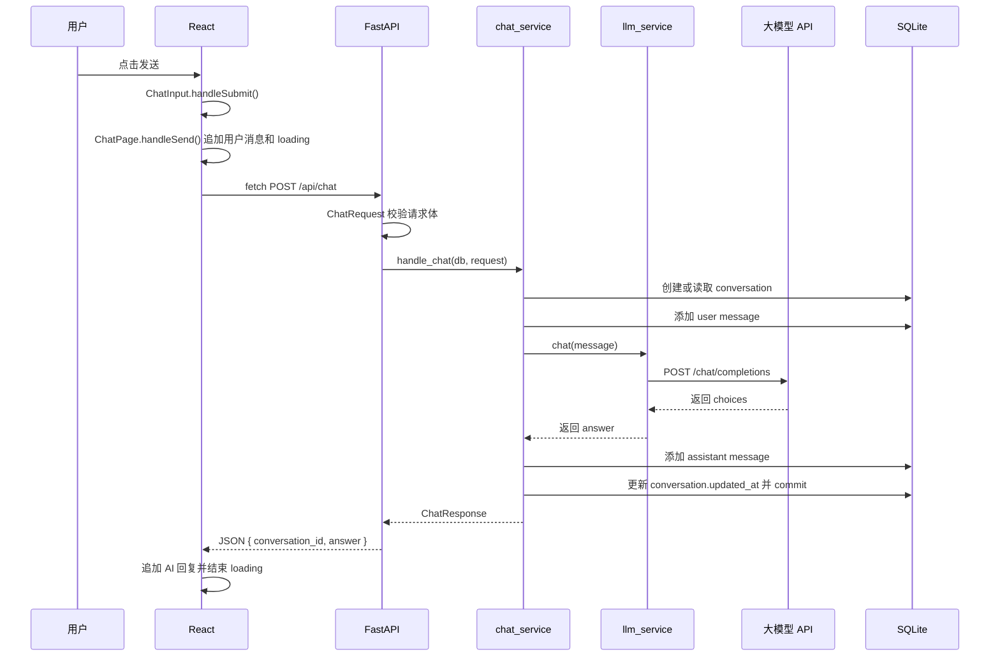

# 用户点击发送后的完整流程

本文按当前项目代码梳理一次聊天请求从前端点击“发送”到写入 SQLite 的完整链路。

## 入口文件

- React 页面入口：`frontend/src/ChatPage.jsx`
- 输入组件：`frontend/src/components/ChatInput.jsx`
- 前端请求封装：`frontend/src/api/chatApi.js`
- FastAPI 路由：`backend/app/api/chat.py`
- 聊天业务层：`backend/app/services/chat_service.py`
- 大模型调用层：`backend/app/services/llm_service.py`
- SQLite ORM：`backend/app/db/database.py`

## 完整步骤

1. 用户在 `ChatInput` 的 `textarea` 输入内容。
2. 用户点击“发送”按钮，触发表单 `onSubmit`。
3. `ChatInput.handleSubmit()` 阻止浏览器默认提交，执行 `trim()` 去掉首尾空白。
4. 如果消息为空或当前正在发送，`ChatInput` 直接返回。
5. `ChatInput` 调用父组件传入的 `onSubmit(message)`，也就是 `ChatPage.handleSend(message)`。
6. `ChatPage.handleSend()` 先创建一条前端临时用户消息，并追加到 `messages` 状态。
7. `ChatPage` 设置 `isLoading = true`，清空旧错误。
8. `ChatPage` 调用 `sendChatMessage(message)`。
9. `sendChatMessage()` 使用 `fetch` 请求 `POST http://127.0.0.1:8001/api/chat`，请求体是 `{ "message": "..." }`。
10. FastAPI 匹配到 `backend/app/api/chat.py` 中的 `POST /api/chat`。
11. FastAPI 使用 `ChatRequest` 校验请求体，确认 `message` 是非空字符串。
12. FastAPI 通过 `Depends(get_db)` 创建一个 SQLAlchemy `Session`。
13. 路由函数把 `db` 和 `request` 交给 `chat_service.handle_chat()`。
14. `chat_service` 没收到 `conversation_id` 时创建 `conversation`，并 `flush()` 得到会话 ID。
15. `chat_service` 向 SQLite 添加一条 `role="user"` 的 `message`。
16. `chat_service` 调用 `llm_service.chat(request.message)`。
17. `llm_service` 校验 `.env` 中的 `LLM_API_KEY`、`LLM_BASE_URL`、`LLM_MODEL`。
18. `llm_service` 用 `build_messages()` 构造 OpenAI-compatible `messages`，请求 `/chat/completions`。
19. 大模型 API 返回后，`llm_service` 从 `choices` 中提取回答文本。
20. `chat_service` 向 SQLite 添加一条 `role="assistant"` 的 `message`。
21. `chat_service` 更新 `conversation.updated_at` 并执行 `db.commit()`。
22. `chat_service` 返回 `ChatResponse(conversation_id, answer)`。
23. FastAPI 把 `ChatResponse` 序列化成 JSON 返回给前端。
24. `sendChatMessage()` 检查响应状态和 `answer` 格式后返回数据。
25. `ChatPage` 把 AI 回复追加到 `messages` 状态，并设置 `isLoading = false`。

## 调用链图



## 简化调用链

```text
React
  ChatInput.handleSubmit()
  ChatPage.handleSend()
  api/chatApi.sendChatMessage()
    ↓ POST /api/chat
FastAPI
  backend/app/api/chat.py
    ↓ chat_service.handle_chat(db, request)
chat_service
  _get_or_create_conversation()
  SQLite: conversation / user message
    ↓ llm_service.chat(message)
llm_service
  build_messages()
  requests.post(.../chat/completions)
    ↓ answer
chat_service
  SQLite: assistant message / conversation.updated_at / commit
    ↓ ChatResponse
React
  显示 AI 回复
```

注意：`llm_service` 本身不直接访问 SQLite。SQLite 的写入由 `chat_service` 统一编排，分别发生在调用大模型前后。
