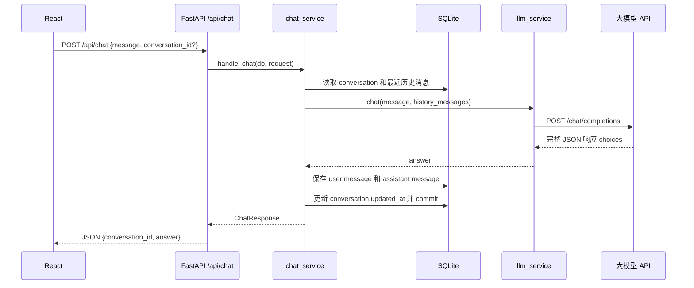
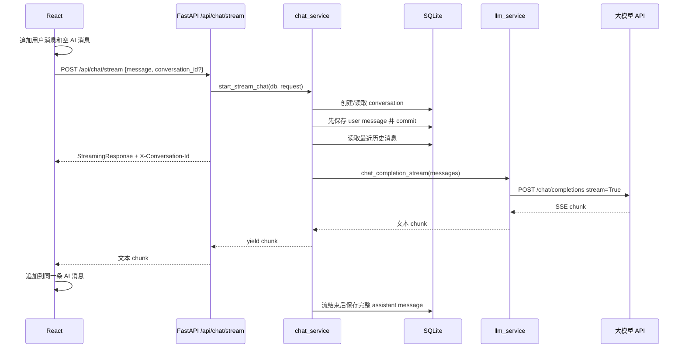
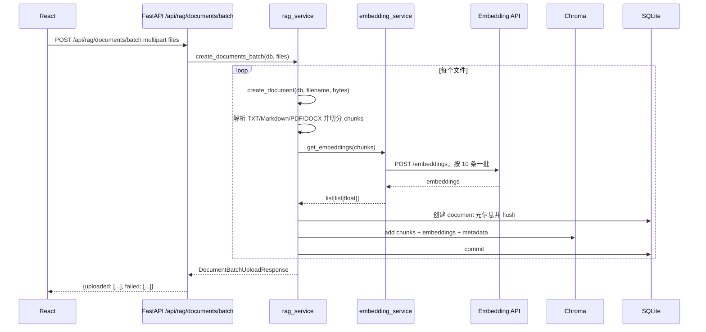
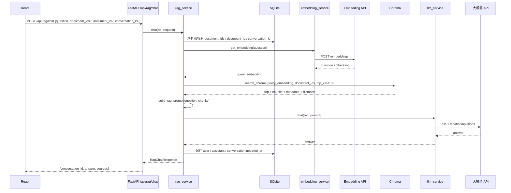
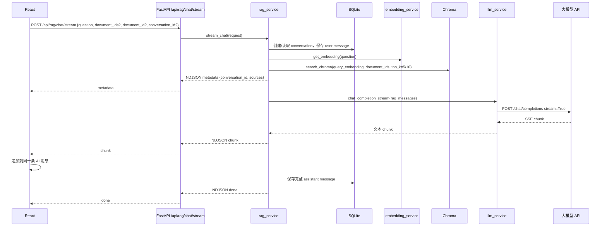

# 聊天调用链整理

本文按当前项目代码整理三条核心链路：

1. 普通聊天调用链：`POST /api/chat`
2. 流式输出调用链：`POST /api/chat/stream`
3. RAG 调用链：`POST /api/rag/documents`、`POST /api/rag/documents/batch`、`POST /api/rag/chat` 和 `POST /api/rag/chat/stream`

当前前端 `ChatPage.jsx` 在“基于文档回答”关闭时默认走流式输出；普通非流式接口仍保留在 `chatApi.js` 中，适合测试或后续切回非流式模式。

## 核心文件

| 层级 | 文件 | 作用 |
| --- | --- | --- |
| React 页面 | `frontend/src/ChatPage.jsx` | 管理消息、会话、文档、RAG 开关，并决定走流式聊天还是 RAG 聊天。 |
| React API | `frontend/src/api/chatApi.js` | 封装普通聊天和流式聊天请求。 |
| React RAG API | `frontend/src/api/ragApi.js` | 封装单文件/批量文档上传、文档列表、普通 RAG 和流式 RAG 请求。 |
| FastAPI 聊天路由 | `backend/app/api/chat.py` | 提供 `POST /api/chat` 和 `POST /api/chat/stream`。 |
| FastAPI RAG 路由 | `backend/app/api/rag.py` | 提供单文件上传、批量上传、文档列表、普通 RAG 和流式 RAG 接口。 |
| 聊天业务层 | `backend/app/services/chat_service.py` | 读取历史、调用 LLM、保存普通/流式聊天消息。 |
| RAG 业务层 | `backend/app/services/rag_service.py` | 文档切分、embedding、Chroma 写入/检索、RAG Prompt、消息落库。 |
| 文档解析服务 | `backend/app/services/document_parser.py` | 从 TXT、Markdown、PDF、DOCX 上传文件中提取纯文本。 |
| LLM 服务 | `backend/app/services/llm_service.py` | 调用 OpenAI-compatible `/chat/completions`，支持普通和 stream。 |
| Embedding 服务 | `backend/app/services/embedding_service.py` | 调用 OpenAI-compatible `/embeddings`，按 10 条一批生成向量。 |
| Chroma 服务 | `backend/app/services/chroma_service.py` | 写入本地 Chroma collection，并按 `document_ids` 范围检索和合并排序。 |
| SQLite ORM | `backend/app/db/database.py` | 保存 conversation、message、document 元信息。 |

## 普通聊天调用链

普通聊天是非流式接口：后端等大模型完整回答生成后，一次性返回 JSON。

```text
React
  ChatPage 或调用方
    ↓
frontend/src/api/chatApi.js
  sendChatMessage(message, conversationId)
    ↓ fetch POST http://127.0.0.1:8001/api/chat
FastAPI
  backend/app/api/chat.py
  chat(request, db = Depends(get_db))
    ↓
chat_service
  handle_chat(db, request)
    ↓
SQLite
  如果有 conversation_id：读取 conversation
  如果没有 conversation_id：先不写库，等模型成功后再创建新会话
    ↓
SQLite
  读取最近 8 条 user/assistant 历史消息
    ↓
llm_service
  chat(message, history_messages)
    ↓
prompt.py
  build_messages(message, history_messages)
    ↓
大模型 API
  POST {LLM_BASE_URL}/chat/completions
    ↓
llm_service
  从 choices 中提取 answer
    ↓
chat_service
  新会话：创建 conversation 并 flush 得到 id
  保存当前 user message
  保存 assistant message
  更新 conversation.updated_at
  db.commit()
    ↓
FastAPI
  返回 ChatResponse { conversation_id, answer }
    ↓
React
  校验 answer 和 conversation_id
  展示 AI 回复
```

### 普通聊天 Mermaid



### 普通聊天关键点

- `chat_service.handle_chat()` 会先读取历史，再调用模型。
- 新会话不会在模型调用前写入 SQLite，避免模型失败后留下空会话。
- 模型成功后，当前用户问题和 AI 回复在同一个事务中提交。
- `llm_service` 不访问 SQLite，只负责模型请求和响应解析。

## 流式输出调用链

流式输出是当前主聊天窗口的默认模式：前端先展示用户消息和一条空 AI 消息，后端边生成边返回文本片段，前端逐块追加到同一条 AI 消息中。

```text
React
  ChatPage.handleSend(message)
  ragEnabled=false
    ↓
React
  追加 user message
  追加空 assistant message
  设置 isLoading=true
    ↓
frontend/src/api/chatApi.js
  sendChatMessageStream(message, conversationId, onChunk, onConversationId)
    ↓ fetch POST http://127.0.0.1:8001/api/chat/stream
FastAPI
  backend/app/api/chat.py
  chat_stream(request)
    ↓
chat_service
  start_stream_chat(db, request)
    ↓
SQLite
  读取或创建 conversation
  先保存当前 user message
  更新 conversation.updated_at
  db.commit()
    ↓
SQLite
  读取最近 8 条历史消息
  此时历史中已经包含当前 user message
    ↓
prompt.py
  build_messages_from_history(history_messages)
    ↓
FastAPI
  返回 StreamingResponse
  响应头 X-Conversation-Id={conversation_id}
    ↓
chat_service
  stream_answer_and_save(conversation_id, messages)
    ↓
llm_service
  chat_completion_stream(messages)
    ↓
大模型 API
  POST {LLM_BASE_URL}/chat/completions stream=True
    ↓
llm_service
  逐行解析 SSE data
  提取 delta.content / message.content / text
    ↓
FastAPI StreamingResponse
  yield chunk, chunk, chunk...
    ↓
React
  response.body.getReader()
  TextDecoder('utf-8')
  每个 chunk 追加到同一条 assistant message
    ↓
chat_service finally
  流结束后保存完整 assistant message
  更新 conversation.updated_at
```

### 流式输出 Mermaid



### 流式输出关键点

- 流式接口没有使用 `Depends(get_db)`，而是在 `chat_stream()` 中手动创建 `SessionLocal()`，因为响应流会在路由函数返回后继续执行。
- `start_stream_chat()` 会先保存当前用户消息，再读取历史，所以构造模型 messages 时使用 `build_messages_from_history()`，不会额外再追加当前问题。
- `X-Conversation-Id` 用响应头返回，前端收到后保存为当前会话 ID。
- `stream_answer_and_save()` 会拼接完整回答，流结束后只保存一条完整 `assistant` 消息。
- 如果流式过程中模型失败，后端会 yield 一段错误文本，并把它作为 assistant 消息的一部分保存。

## RAG 调用链

RAG 分两段：先上传文档入库，再基于文档问答。

### RAG 文档上传链路

上传文档时，SQLite 只保存文档元信息；chunk 文本、embedding 和 metadata 写入 Chroma。原有单文件接口保留，主聊天窗口支持一次选择多个文件并调用批量上传接口。

```text
React
  DocumentToolbar 选择一个或多个 TXT/Markdown/PDF/DOCX 文件
    ↓
ChatPage.handleUploadDocuments(files)
    ↓
frontend/src/api/ragApi.js
  uploadDocuments(files)
  FormData.append('files', file)
    ↓ fetch POST http://127.0.0.1:8001/api/rag/documents/batch
FastAPI
  backend/app/api/rag.py
  upload_documents_batch(files, db)
    ↓
rag_service
  create_documents_batch(db, files)
  每个文件独立调用 create_document()
    ↓
document_parser
  根据后缀解析 TXT / Markdown / PDF / DOCX，返回纯文本
    ↓
rag_service
  split_text_into_chunks()
    ↓
embedding_service
  get_embeddings(chunks)
  每 10 条 chunk 分一批请求 embedding
    ↓
Embedding API
  POST {EMBEDDING_BASE_URL}/embeddings
    ↓
rag_service
  创建 Document 元信息
  db.flush() 得到 document.id
    ↓
chroma_service
  add_chunks_to_chroma(document_id, filename, file_type, chunks, embeddings)
    ↓
Chroma
  collection.add(ids, documents, embeddings, metadatas)
  metadata 包含 document_id / filename / file_type / chunk_index / created_at
    ↓
SQLite
  db.commit()
    ↓
FastAPI
  返回 DocumentBatchUploadResponse {uploaded, failed}
    ↓
React
  刷新文档列表
  选中本次成功上传的文档
  打开 ragEnabled
```

### RAG 文档上传 Mermaid



### RAG 普通问答链路

普通 RAG 问答使用 `POST /api/rag/chat`。该接口保留给调试、脚本调用或后续非流式模式；当前主聊天界面在开启“基于文档回答”时默认走流式 RAG。普通接口会先解析 `document_ids` 范围，把问题转成 embedding，检索 Chroma，拼 RAG Prompt，再调用聊天模型，最后一次性返回 answer 和 sources。

```text
API 调用方
  调用 ragChat({question, document_ids, conversation_id})
    ↓
frontend/src/api/ragApi.js
  ragChat({question, document_ids, conversation_id})
    ↓ fetch POST http://127.0.0.1:8001/api/rag/chat
FastAPI
  backend/app/api/rag.py
  rag_chat(request, db)
    ↓
rag_service
  chat(db, request)
    ↓
SQLite
  document_ids 优先于 document_id
  如果 document_ids 有值：确认这些文档都存在
  如果 document_ids 为空数组或未传：确认至少上传过一个文档，然后检索全部文档
  如果指定 conversation_id：确认会话存在
    ↓
embedding_service
  get_embedding(question)
    ↓
Embedding API
  POST {EMBEDDING_BASE_URL}/embeddings
    ↓
chroma_service
  search_chroma(query_embedding, document_ids, top_k=5/10)
    ↓
Chroma
  未限定文档时 collection.query()
  限定多个文档时按 document_id where 过滤，多次查询后合并排序
  返回 top-k documents / metadatas / distances
    ↓
rag_service
  转成 RagSource
  build_rag_prompt(question, source_contents)
    ↓
llm_service
  chat(rag_prompt)
    ↓
大模型 API
  POST {LLM_BASE_URL}/chat/completions
    ↓
rag_service
  如果是新会话：创建 conversation 并 flush
  保存 user question
  保存 assistant answer
  更新 conversation.updated_at
  db.commit()
    ↓
FastAPI
  返回 RagChatResponse {conversation_id, answer, sources}
    ↓
调用方
  一次性拿到 answer 和 sources
```

### RAG 问答 Mermaid



### RAG 流式问答链路

当前前端打开“基于文档回答”时，会走 `POST /api/rag/chat/stream`。已勾选文档时传 `document_ids`，未勾选时传 `document_ids: []` 表示检索全部已上传文档。后端返回 NDJSON：先返回 metadata，随后逐步返回 chunk，最后返回 done。

```text
React
  ChatPage.handleSend(message)
  ragEnabled=true
    ↓
frontend/src/api/ragApi.js
  ragChatStream({question, document_ids, conversation_id, onMetadata, onChunk, onDone, onError})
    ↓ fetch POST http://127.0.0.1:8001/api/rag/chat/stream
FastAPI
  backend/app/api/rag.py
  rag_chat_stream(request)
    ↓
StreamingResponse(rag_service.stream_chat(request))
    ↓
rag_service
  校验 question / document_ids / document_id / conversation_id
  新会话时创建 conversation
  先保存当前 user message 并 commit
    ↓
embedding_service
  get_embedding(question)
    ↓
chroma_service
  search_chroma(query_embedding, document_ids, top_k=5/10)
    ↓
rag_service
  yield {"type":"metadata","conversation_id":...,"sources":[...]}
  build_rag_prompt(question, source_contents)
    ↓
llm_service
  chat_completion_stream(messages)
    ↓
大模型 API
  POST {LLM_BASE_URL}/chat/completions stream=True
    ↓
rag_service
  每个模型 chunk yield {"type":"chunk","content":"..."}
  同时拼接 full_answer
    ↓
SQLite
  流结束后保存一条完整 assistant message
    ↓
rag_service
  yield {"type":"done"}
```

### RAG 流式问答 Mermaid



### RAG 关键点

- 旧字段 `document_id` 继续兼容；新字段 `document_ids` 优先级更高。
- `document_ids` 有值时只检索这些文档；`document_ids: []` 或未传时检索 Chroma 中全部文档。
- 当前前端开启 RAG 后可以勾选多个文档；未勾选具体文档时默认传空数组，让后端检索全部已上传文档。
- 单文档检索使用 top 5，多文档或全部文档检索使用 top 10。
- `embedding_service` 负责文本转向量，不参与业务判断。
- `chroma_service` 只保存和检索 chunk 文本、embedding、metadata。
- 新上传文档的 Chroma metadata 包含 `document_id`、`filename`、`file_type`、`chunk_index`、`created_at`；旧数据可能缺少 `file_type`。
- `rag_service` 负责把检索出来的 chunk 拼成 RAG Prompt；普通 RAG 用 `llm_service.chat()`，流式 RAG 用 `llm_service.chat_completion_stream()`。
- RAG 问答会把 user question 和 assistant answer 保存到普通 `message` 表，因此历史会话列表仍然复用同一套 conversation/message。
- 流式 RAG 不会每个 chunk 保存一次数据库，只在流结束后保存一条完整 assistant message。

## 三条链路对比

| 链路 | 前端请求 | 后端返回 | 是否流式 | 是否用 Chroma | SQLite 写入 |
| --- | --- | --- | --- | --- | --- |
| 普通聊天 | `POST /api/chat` | `{conversation_id, answer}` | 否 | 否 | 模型成功后保存 user + assistant |
| 流式聊天 | `POST /api/chat/stream` | 文本流 + `X-Conversation-Id` | 是 | 否 | 先保存 user，流结束后保存 assistant |
| RAG 单文件上传 | `POST /api/rag/documents` | `{document_id, filename, file_type, chunk_count}` | 否 | 是，写入 chunks | 保存 document 元信息 |
| RAG 批量上传 | `POST /api/rag/documents/batch` | `{uploaded, failed}` | 否 | 是，逐文件写入 chunks | 保存成功文件的 document 元信息 |
| RAG 问答 | `POST /api/rag/chat` | `{conversation_id, answer, sources}` | 否 | 是，按 `document_ids` 检索 chunks | 保存 user + assistant |
| RAG 流式问答 | `POST /api/rag/chat/stream` | NDJSON metadata/chunk/done/error | 是 | 是，按 `document_ids` 检索 chunks | 先保存 user，流结束后保存 assistant |

## 历史会话加载链路

历史会话和聊天链路分开，页面启动和发送成功后都会刷新。

```text
ChatPage
  ↓ fetchConversations()
GET /api/conversations
  ↓
conversation_service 从 SQLite 读取 conversation 摘要
  ↓
ConversationList 展示历史会话
```

点击历史会话：

```text
用户点击左侧会话
  ↓
ChatPage.handleSelectConversation(conversationId)
  ↓ fetchConversationMessages(conversationId)
GET /api/conversations/{conversation_id}/messages
  ↓
conversation_service 从 SQLite 读取该会话消息
  ↓
ChatPage 设置 conversationId 和 messages
```
