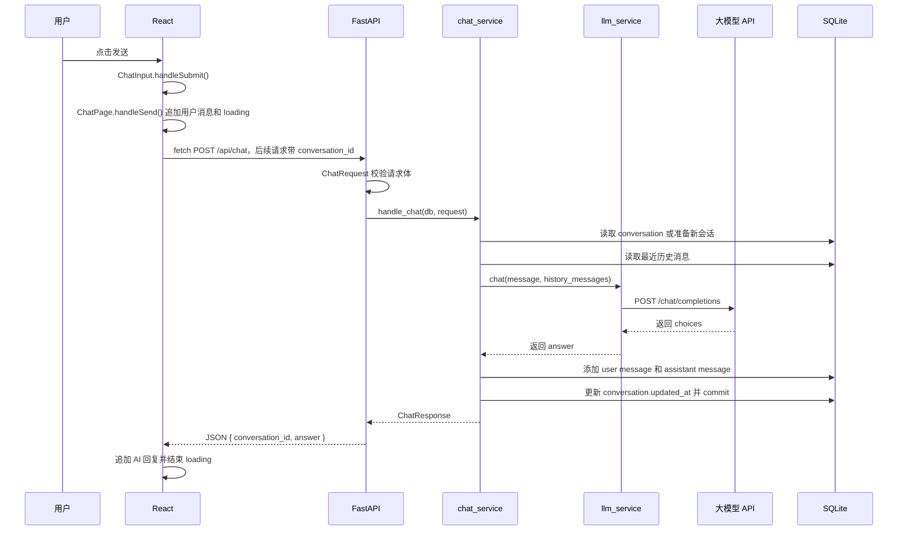

# 用户点击发送后的完整流程

本文按当前项目代码梳理一次聊天请求从前端点击“发送”到写入 SQLite 的完整链路。

## 入口文件

- React 页面入口：`frontend/src/ChatPage.jsx`
- 输入组件：`frontend/src/components/ChatInput.jsx`
- 前端请求封装：`frontend/src/api/chatApi.js`
- FastAPI 路由：`backend/app/api/chat.py`
- 聊天业务层：`backend/app/services/chat_service.py`
- 大模型调用层：`backend/app/services/llm_service.py`
- SQLite ORM：`backend/app/db/database.py`

## 完整步骤

1. 用户在 `ChatInput` 的 `textarea` 输入内容。
2. 用户点击“发送”按钮，触发表单 `onSubmit`。
3. `ChatInput.handleSubmit()` 阻止浏览器默认提交，执行 `trim()` 去掉首尾空白。
4. 如果消息为空或当前正在发送，`ChatInput` 直接返回。
5. `ChatInput` 调用父组件传入的 `onSubmit(message)`，也就是 `ChatPage.handleSend(message)`。
6. `ChatPage.handleSend()` 先创建一条前端临时用户消息，并追加到 `messages` 状态。
7. `ChatPage` 设置 `isLoading = true`，清空旧错误。
8. `ChatPage` 调用 `sendChatMessage(message)`。
9. `sendChatMessage()` 使用 `fetch` 请求 `POST http://127.0.0.1:8001/api/chat`，第一次请求体是 `{ "message": "..." }`，后续追问会带上 `{ "conversation_id": 当前会话 ID }`。
10. FastAPI 匹配到 `backend/app/api/chat.py` 中的 `POST /api/chat`。
11. FastAPI 使用 `ChatRequest` 校验请求体，确认 `message` 是非空字符串。
12. FastAPI 通过 `Depends(get_db)` 创建一个 SQLAlchemy `Session`。
13. 路由函数把 `db` 和 `request` 交给 `chat_service.handle_chat()`。
14. `chat_service` 没收到 `conversation_id` 时先按新会话处理，不立刻写库；如果收到 `conversation_id`，先确认会话存在。
15. 如果是已有会话，`chat_service` 从 SQLite 读取最近 8 条 `user/assistant` 历史消息，并按旧到新排序。
16. `chat_service` 调用 `llm_service.chat(request.message, history_messages)`，当前问题会放在模型 messages 的最后。
17. `llm_service` 校验 `.env` 中的 `LLM_API_KEY`、`LLM_BASE_URL`、`LLM_MODEL`。
18. `llm_service` 用 `build_messages()` 构造 OpenAI-compatible `messages`：system prompt、最近历史消息、当前用户问题，然后请求 `/chat/completions`。
19. 大模型 API 返回后，`llm_service` 从 `choices` 中提取回答文本。
20. 模型成功后，如果是新会话，`chat_service` 创建 `conversation` 并 `flush()` 得到会话 ID；然后向 SQLite 添加本轮 `role="user"` 的当前问题和 `role="assistant"` 的 AI 回复。
21. `chat_service` 更新 `conversation.updated_at` 并执行 `db.commit()`。
22. `chat_service` 返回 `ChatResponse(conversation_id, answer)`。
23. FastAPI 把 `ChatResponse` 序列化成 JSON 返回给前端。
24. `sendChatMessage()` 检查响应状态和 `answer` 格式后返回数据。
25. `ChatPage` 保存后端返回的 `conversation_id`，把 AI 回复追加到 `messages` 状态，并设置 `isLoading = false`。

## 调用链图



## 简化调用链

```text
React
  ChatInput.handleSubmit()
  ChatPage.handleSend()
  api/chatApi.sendChatMessage()
    ↓ POST /api/chat
FastAPI
  backend/app/api/chat.py
    ↓ chat_service.handle_chat(db, request)
chat_service
  _get_conversation()
  SQLite: conversation / recent messages
    ↓ llm_service.chat(message, history_messages)
llm_service
  build_messages(message, history_messages)
  requests.post(.../chat/completions)
    ↓ answer
chat_service
  SQLite: assistant message / conversation.updated_at / commit
    ↓ ChatResponse
React
  显示 AI 回复
```

注意：`llm_service` 本身不直接访问 SQLite。SQLite 的读取和写入由 `chat_service` 统一编排；普通接口当前实现先读取历史，再调用模型，模型成功后再保存本轮 user 和 assistant 消息，避免当前问题重复进入上下文。

## 流式输出流程

流式输出使用 `POST /api/chat/stream`，请求体仍然是 `message` 和可选的 `conversation_id`。它和普通接口最大的区别是：后端不等待完整回答生成完才返回 JSON，而是用 `StreamingResponse` 把模型产生的文本片段逐步返回给前端。

后端步骤：

1. `api/chat.py` 接收 `POST /api/chat/stream`。
2. `chat_service.start_stream_chat()` 读取或创建 conversation。
3. 后端先保存当前 `role="user"` 消息，因为流式响应开始后不能等到最后才告诉前端新会话 ID。
4. 后端从 SQLite 读取最近 8 条 `user/assistant` 消息。此时历史里已经包含当前用户问题，所以构造模型 `messages` 时不再额外追加当前问题。
5. `prompt.build_messages_from_history()` 构造 `system prompt + 最近历史消息`。
6. `llm_service.chat_completion_stream()` 使用 `stream=True` 请求 OpenAI-compatible 大模型接口。
7. 模型每返回一个 chunk，`chat_service.stream_answer_and_save()` 就 `yield` 给 FastAPI。
8. 同时后端用 `full_answer += chunk` 拼接完整回答。
9. 流结束后，后端只保存一条完整的 `role="assistant"` 消息，并更新 `conversation.updated_at`。

前端步骤：

1. `ChatPage.handleSend()` 先把用户消息加入 `messages`。
2. 前端再加入一条空的 assistant 消息，作为后续流式内容的容器。
3. `chatApi.sendChatMessageStream()` 请求 `POST http://127.0.0.1:8001/api/chat/stream`。
4. 前端从响应头读取 `X-Conversation-Id` 并保存为当前会话 ID。
5. 前端使用 `response.body.getReader()` 读取流。
6. 每次读到 chunk，就用 `TextDecoder("utf-8")` 转成字符串，并追加到同一条 assistant 消息的 `content`。
7. 流结束后关闭 loading，并刷新左侧历史会话列表。

简化调用链：

```text
React ChatPage.handleSend()
  ↓ sendChatMessageStream()
FastAPI POST /api/chat/stream
  ↓ chat_service.start_stream_chat()
SQLite 保存当前 user message，读取最近历史
  ↓ llm_service.chat_completion_stream(messages)
大模型 API stream=True
  ↓ chunk, chunk, chunk...
StreamingResponse 逐步返回文本
  ↓
React getReader() 逐块追加到同一条 AI 消息
  ↓
后端流结束后保存一条完整 assistant message
```

## 历史会话加载流程

```text
页面刷新或首次打开
  ↓
ChatPage 调用 fetchConversations()
  ↓ GET /api/conversations
conversation_service 从 SQLite 读取 conversation 摘要
  ↓
左侧 ConversationList 显示历史会话
```

点击某个历史会话：

```text
用户点击左侧会话
  ↓
ChatPage 调用 fetchConversationMessages(conversationId)
  ↓ GET /api/conversations/{conversation_id}/messages
conversation_service 从 SQLite 读取该会话的 user/assistant 消息
  ↓
ChatPage 设置当前 conversationId，并把消息加载到右侧聊天窗口
  ↓
后续继续提问时，POST /api/chat 会携带同一个 conversation_id
```

点击“新建会话”：

```text
用户点击新建会话
  ↓
ChatPage 清空 messages，并把 conversationId 设置为 null
  ↓
下一次提问 POST /api/chat 不带 conversation_id
  ↓
chat_service 在模型成功后创建新的 conversation
  ↓
前端刷新左侧历史会话列表
```
